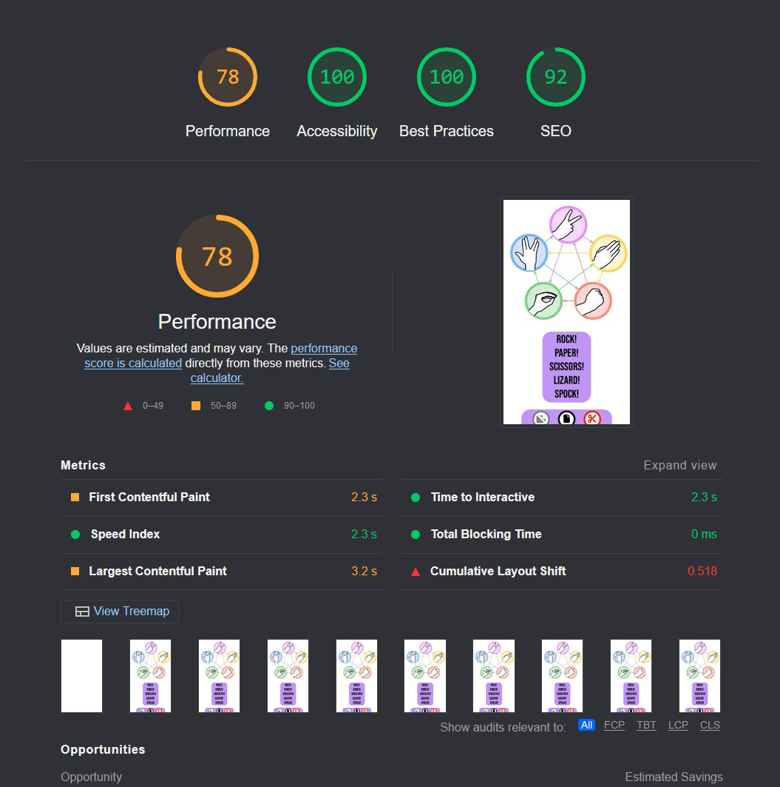
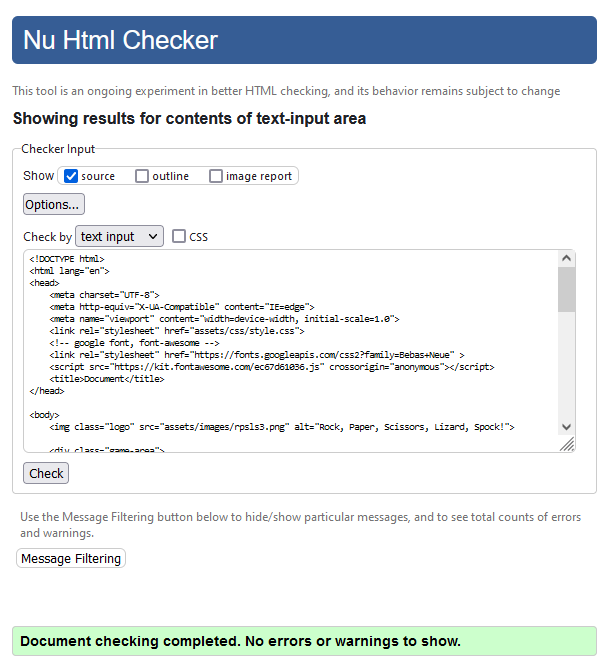
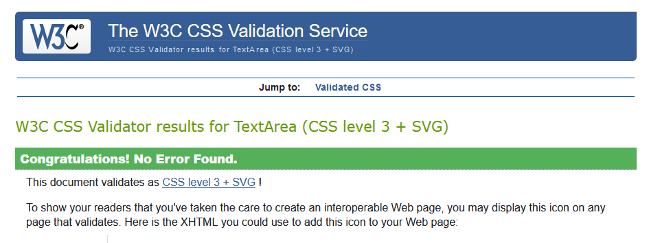
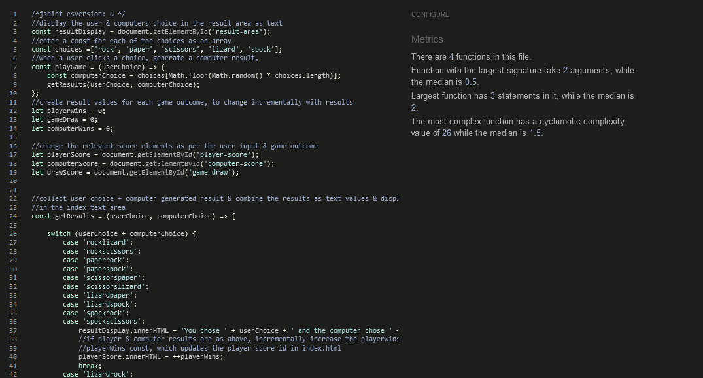

*********************
# Rock, Paper, Scissors, Lizard, Spock!

"Rock, Paper, Scissors, Lizard, Spock" (hereafter refored to as RPSLS) is a website that allows users to play an enhanced game of 'Rock Paper Scissors' with the additional 'Lizard' & 'Spock' choices against a Computer, and to track the game score. 

### Existing Features

* Responsive design; works on different sized devices
* Buttons submit Player move
* Random Computer move
* Text that returns the game result, which changes depending on the Player & Computer choices
* Text that explains if the Player Won, Lost, or Drew
* Score tracking for Player, Computer, and Draw outcomes of game

### Features Left to Implement

* Add text 'Rules' block for the RPSLS game
* Add a user vs user game mode
* Buttons that match the logo image
* Fix formatting for large screen devices (tv's etc)

### Wireframes
- Add in to readme if time permitting

## Technologies

* HTML
    * The structure of the Website was developed using HTML as the main language.
* CSS
    * The Website was styled using custom CSS in an external file.
* JS
    * The websites interactivity was programmed in Javascript
* Visual Studio Code
    * The website was developed using Visual Studio Code IDE
* GitHub
    * Source code is hosted on GitHub and delpoyed using Git Pages.
* Git 
    * Used to commit and push code during the development opf the Website
* Font Awesome
    * Icons obtained from https://fontawesome.com/ were used as the Social media links in the footer section. 
* Google Fonts
    * https://fonts.googleapis.com/ was used for the websites main font "Bebas Neue"


## Testing 


### Responsiveness

All pages were tested to ensure responsiveness on screen sizes from 320px and upwards as defined in [WCAG 2.1 Reflow criteria for responsive design](https://www.w3.org/WAI/WCAG21/Understanding/reflow.html) on Chrome, Edge, Firefox and Opera browsers.

Steps to test:

1. Open browser and navigate to [Rock, Paper, Scissors, Lizard, Spock!](https://seanhub2021.github.io/Project_2_Example1/)
2. Open the developer tools (right click and inspect)
3. Set to responsive and decrease width to 320px
4. Set the zoom to 50%
5. Click and drag the responsive window to maximum width

Expected:

Website is responsive on all screen sizes and no images are pixelated or stretched, no video content becomes warped or unresponsive.
No horizontal scroll is present.
No elements overlap.

Actual:

Website behaved as expected. 

### Accessibility
Wave Report - https://wave.webaim.org/report#/https://seanhub2021.github.io/Project_2_Example1/

### Lighthouse Testing



### Validator Testing 

- HTML
  - No errors were returned when passing through the official [W3C validator](https://validator.w3.org)




- CSS
  - No errors were found when passing through the official [(Jigsaw) validator](https://jigsaw.w3.org/css-validator/)



- JS
  - No errors were found when passing through the official [(JSHint) validator](https://jshint.com/)



### Functional Testing

**Game Buttons & Results**

Testing was performed to ensure all possible user button choices & random computer choices returned accurate results within the rules of the RPSLS game, the correct text appears to show the user what the computers random selection was, the outcome of the game, and that the score was logged and increased accordingly. 

For example;

User/Player selects the Rock button, Result area returns the text "You chose Rock and the computer chose Paper, You Lose!", Computer Score increases by 1. 

Expected:

The game to work, scores to increment, computer choice is randomly selected from available options, and the game is playable. The following results to correspond with score increases;

Scissors cuts Paper
Scissors decapitates Lizard

Paper covers Rock
Paper disproves Spock

Rock crushes Lizard
Rock crushes Scissors

Lizard poisons Spock
Lizard eats Paper

Spock smashes Scissors
Spock vaporizes Rock

Actual:

Javascript game worked as expected. 

### Unfixed Bugs
GEThttps://8000-seanhub2021-project2exa-e99yoku869g.ws-eu64.gitpod.io/favicon.ico
[HTTP/2 404 Not Found 29ms]
-error with the websites favicon icon. Will fix in next update. 

## Deployment

### Version Control
The site was created using the Visual Studio code editor and pushed to github to the remote repository https://github.com/SeanHub2021/Project_2_Example1

The following git commands were used throughout development to push code to the remote repo:

```git add <file>``` - This command was used to add the file(s) to the staging area before they are committed.

```git commit -m “commit message”``` - This command was used to commit changes to the local repository queue ready for the final step.

```git push``` - This command was used to push all committed code to the remote repository on github.

### Deployment to Github Pages

- The site was deployed to GitHub pages. The steps to deploy are as follows: 
  - In the GitHub repository, navigate to the Settings tab 
  - From the menu on left select 'Pages'
  - From the source section drop-down menu, select the Branch: main
  - Click 'Save'
  - A live link will be displayed in a green banner when published successfully. 

The live link can be found here - https://seanhub2021.github.io/Project_2_Example1/

### Clone the Repository Code Locally

Navigate to the GitHub Repository you want to clone to use locally:

- Click on the code drop down button
- Click on HTTPS
- Copy the repository link to the clipboard
- Open your IDE of choice (git must be installed for the next steps)
- Type git clone copied-git-url into the IDE terminal

The project will now of been cloned on your local machine for use.

## Credits 

* [RPSLS - Rules](https://bigbangtheory.fandom.com/wiki/Rock,_Paper,_Scissors,_Lizard,_Spock)
    * Rules for the game, particularly interactions with Lizard & Spock, found here.

### Content 

All content with the exception of those listed in the Media section of this document was owned by Williams Wellness Website. 
Permission was granted from rights holders for the images, or the images were from public use sites. 

### Media
Main logo, "rpsls3" can be found originally here;
https://www.pngitem.com/middle/hJJoibm_rock-paper-scissors-lizard-spock-is-a-funny/